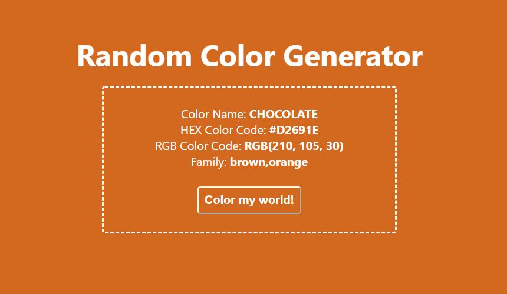

# random-color-generator

## Random Color Generator



[Demo Website](https://reuelo.github.io/random-color-generator/)

This is a basic website (built using HTML, CSS and jQuery) for generating and displaying random colors from a bunch.

This project is inspired by John Smilga's "Javascript Basic Projects":

```https://github.com/john-smilga/javascript-basic-projects.```

The "rainbow" 🌈 hails from "Jenny Knuth's Block": 

```https://bl.ocks.org/jennyknuth/e2d9ee930303d5a5fe8862c6e31819c5.```
